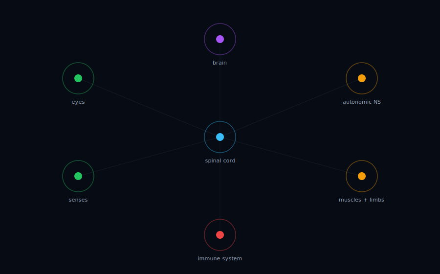

# mycelium

*A personal operating system isn't a toolkit. It's an organism.*



## The thesis

We've been building productivity **stacks** when we should've been growing **organisms**.

Your calendar doesn't know your heart rate. Your home automation doesn't know what's on your mind. Your agent frameworks call APIs but don't have a nervous system — a substrate where every sense, every limb, every reflex shares a single bloodstream. When a light flickers at 2 a.m., the question isn't *"which service caught it?"* — it's *"what did the organism do about it?"*

mycelium is an opinionated pattern for building the organism: a durable event bus as spinal cord, supervised agents as muscles, pluggable adapters as limbs, and a doctrine of four promises that make the whole thing worth running.

## The four promises

**1. Bi-directional.** Every limb informs the brain; the brain can move every limb. If a camera sees a person at the door, the event propagates to the language model, the lights, and the notification channel on the same bus — there's no "sensor side" and "actuation side."

**2. Self-defending.** Intrusion, anomaly, or a failed health-check fires a real event. A watchdog agent subscribes. It investigates. It responds — locks the doors, rotates a credential, pages you, quarantines a process — without a human tap.

**3. Self-healing.** Every long-running process is supervised. Crashes trigger exponential-backoff restarts. Failed cloud hops fall back to local queues. The mesh degrades, it doesn't collapse.

**4. Self-improving.** Agents in the mesh can write code that extends the organism. A new adapter, a new reflex, a new memory — proposed by the brain, reviewed by a human or a policy gate, committed, redeployed. The organism grows.

## What's in this repo

- **`README.md`** — this manifesto.
- **`docs/philosophy.md`** — the long version.
- **`docs/architecture.md`** — which real components map to which organs.
- **`docs/brain.md`** — the brain contract: what goes in the reasoning slot.
- **`docs/diagrams/organism.html`** — an animated diagram of the organism in motion.
- **`packages/mesh-core/`** — the working substrate. Event bus, supervisor, adapter pattern. Apache-2.0. TypeScript. `pnpm add @mycelium/core`.
- **`packages/mesh-brain/`** — the reasoning organ: `Brain` contract + `SimpleBrain` + `attachBrain`. Provider-agnostic — plug in Claude, OpenAI, Ollama, LiteLLM, or a private service.
- **`docs/recipes/`** — concrete deployments. Start with [`starter/`](docs/recipes/starter) (no hardware) or [`homelab-nuc/`](docs/recipes/homelab-nuc) (full single-host organism).

## The minimum viable organism

```ts
import { Bus, Supervisor, MqttAdapter } from '@mycelium/core';

const bus = new Bus({
  adapter: new MqttAdapter({ url: 'mqtt://localhost:1883' }),
  logPath: './events.db',
});
await bus.connect();

bus.on('motion:detected', async (evt) => {
  // the simplest reflex: a limb reacts to a sense
  await bus.publish('light:turn-on', { room: evt.room });
});

const sup = new Supervisor();
sup.register({ name: 'frigate', run: async () => {/* camera pipeline */} });
sup.register({ name: 'brain', run: async () => {/* llm loop */} });
await sup.start();
```

That's the spinal cord. Everything else — vision, language, scheduling, memory — hangs off it as an adapter.

## Status

**Phase A (this release):** manifesto, architecture docs, animated organism diagram.
**Phase B (this release):** `@mycelium/core` — bus, supervisor, three reference adapters, tests.
**Phase C (rolling in):** concrete deployment recipes under `docs/recipes/` — specific hardware, specific brands, sanitized to run on yours.
**Phase D (later):** opinionated installer for the full substrate.

The brain (intelligence + memory service) and the domain-specific limbs stay in their own repos. mycelium is the pattern and the spinal cord.

## Contribute

Read `docs/philosophy.md`, then `packages/mesh-core/README.md`. Recipes and adapters are the quickest way to contribute — pick a device, pick a brand, ship a folder under `docs/recipes/your-recipe-name/`.

## License

Apache-2.0. Use it, embed it, fork it. The only thing you can't do is claim you wrote the doctrine.
